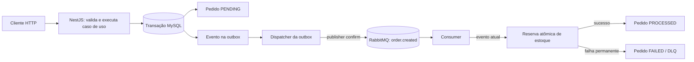
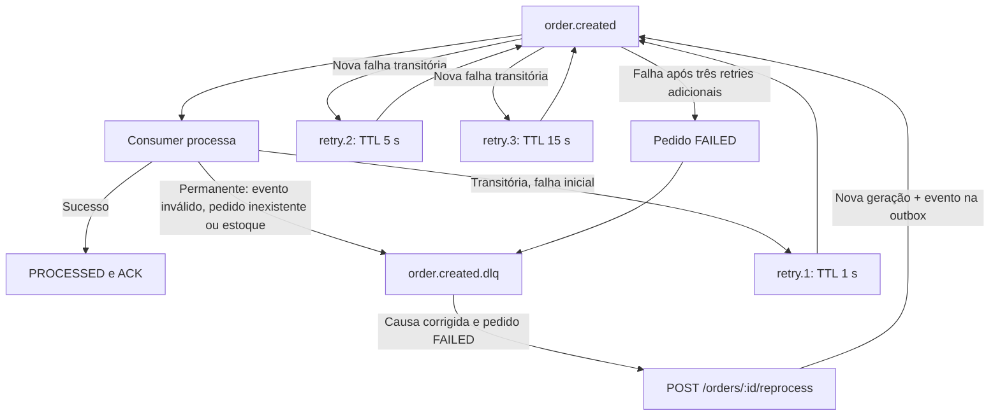
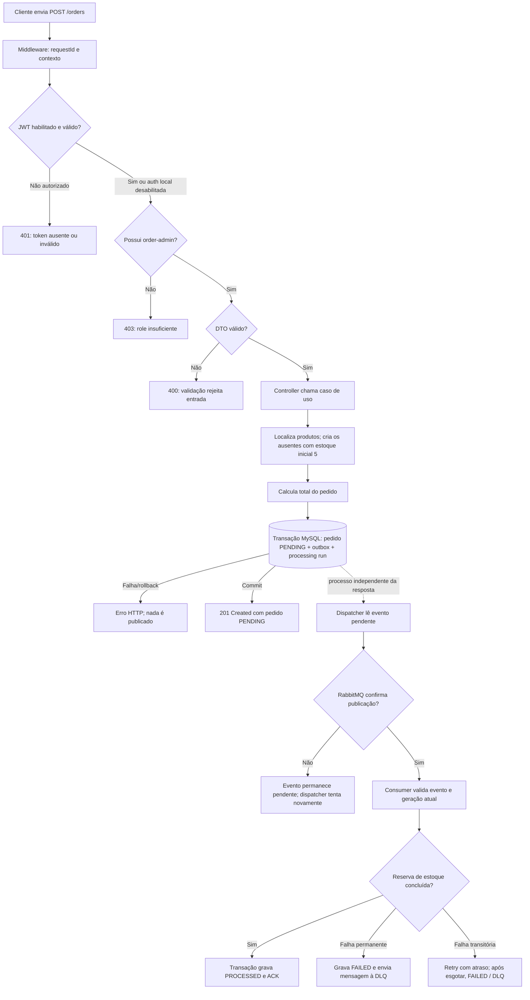
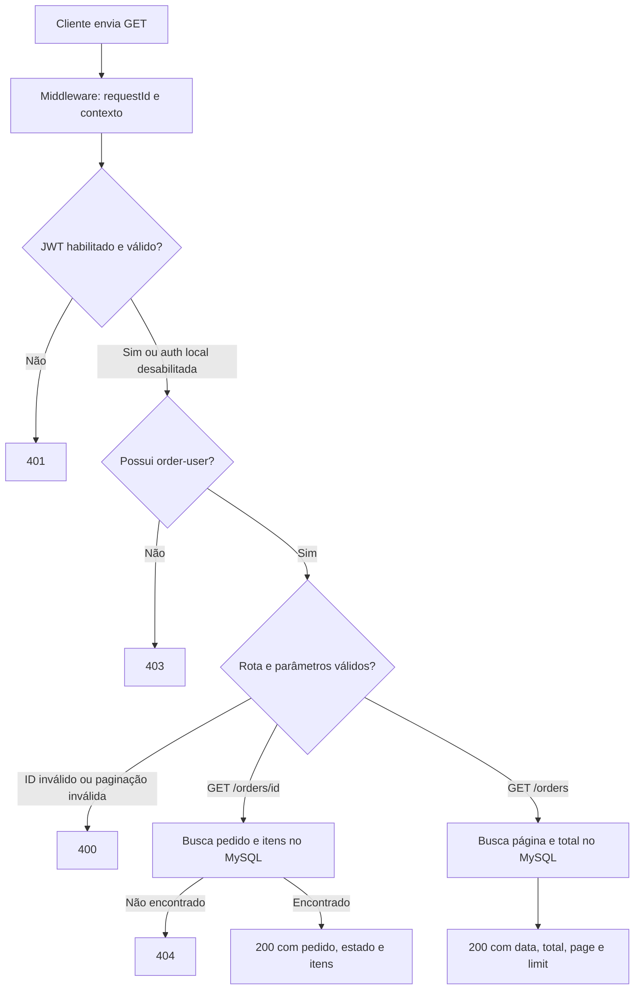
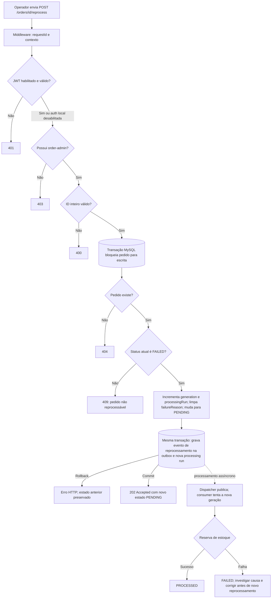
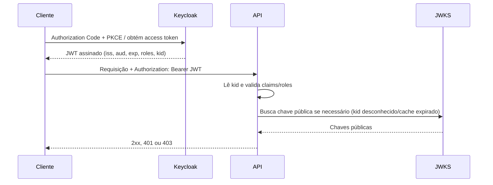

# Order API

API de pedidos construída com NestJS. Ela grava pedidos no MySQL, publica eventos pelo RabbitMQ e processa reservas de estoque de forma assíncrona. O Keycloak pode autenticar e autorizar chamadas, e um profile opcional reúne ferramentas locais de logs, métricas e traces.

> **Importante:** o Compose padrão é voltado somente para desenvolvimento local. Ele desativa autenticação explicitamente e publica serviços em `127.0.0.1`; não exponha essa configuração como ambiente protegido.

## 1. 📌 Visão geral do projeto

### Stack e responsabilidades

| Componente | Responsabilidade |
| --- | --- |
| NestJS / Node.js | API HTTP, validação, casos de uso e worker RabbitMQ. |
| MySQL / TypeORM | Pedidos, itens, estoque, histórico de execuções e outbox transacional. Migrations versionadas aplicam o schema. |
| RabbitMQ | Transporte assíncrono, filas de retry com atraso e dead-letter queue (DLQ). |
| Keycloak | Emissão de access tokens. A API valida tokens como *Resource Server*; não faz login nem guarda senhas. |
| Prometheus / Grafana | Coleta e visualização de métricas e regras de alerta locais. |
| Loki / Alloy | Agregação local dos logs JSON dos containers. |
| OpenTelemetry / Collector / Tempo | Propagação, exportação e consulta de traces. |

### Organização do código

- `src/domain/`: entidades, contratos de repositório, eventos e regras do domínio; não depende de NestJS, TypeORM ou RabbitMQ.
- `src/application/`: casos de uso que orquestram pedidos, eventos e processamento.
- `src/infrastructure/`: persistência TypeORM, entidades, migrations e datasource.
- `src/presentation/`: controllers, DTOs, validação e documentação HTTP/Swagger.
- `src/queue/`: integração RabbitMQ, dispatcher da outbox, consumer e políticas de retry.
- `src/auth/` e `src/observability/`: autenticação/autorização e instrumentação transversal.
- `test/`: testes E2E e de aceitação; `observability/`: configurações versionadas da stack local.

### Fluxo geral de pedido

O diagrama mostra o caminho do pedido. A gravação do pedido e do evento na outbox participa da mesma transação MySQL; só depois um dispatcher publica no RabbitMQ.



## 2. 🚀 Início rápido (Docker local)

### Pré-requisitos

- Docker Engine 24 ou superior.
- Docker Compose v2, invocado como `docker compose`.
- Para desenvolver sem Docker: Node.js 22 ou superior e npm.

### Subir a aplicação

1. Copie o arquivo de exemplo. Ele contém configuração local de desenvolvimento, não credenciais para produção:

   ```bash
   cp .env.example .env
   ```

2. Valide a interpolação do Compose antes de iniciar. `--quiet` valida sem imprimir a configuração expandida:

   ```bash
   docker compose config --quiet
   ```

3. Construa as imagens e inicie os serviços em segundo plano. O Compose espera MySQL e RabbitMQ saudáveis, executa migrations e então inicia a API:

   ```bash
   docker compose up --build -d
   ```

4. Confira o estado dos containers; `migrate` deve terminar com sucesso e os serviços persistentes devem ficar em execução:

   ```bash
   docker compose ps
   ```

### Portas locais

| Serviço | Porta padrão no host | Variável de override |
| --- | ---: | --- |
| API | `3000` | `API_PORT` |
| MySQL | `3306` | `MYSQL_PORT` |
| RabbitMQ AMQP | `5672` | `RABBITMQ_PORT` |
| RabbitMQ Management | `15672` | `RABBITMQ_MANAGEMENT_PORT` |
| Grafana (profile opcional) | `3001` | fixa no Compose |
| Prometheus (profile opcional) | `9090` | fixa no Compose |
| Loki (profile opcional) | `3101` no host (`3100` no container) | fixa no Compose |
| Tempo (profile opcional) | `3200` | fixa no Compose |

O Compose publica as portas de desenvolvimento em loopback. Entre containers, use os nomes `mysql` e `rabbitmq`; no host, use `localhost`. RabbitMQ Management já vem na imagem `rabbitmq:3.13-management` e pode ser acessado em <http://localhost:15672>. Use `RABBITMQ_USER` e `RABBITMQ_PASSWORD` do `.env`; se não estiverem definidos, os valores de desenvolvimento do Compose são `app` / `app`.

Para acompanhar a API e parar os serviços mantendo os dados, use:

```bash
docker compose logs -f api
docker compose down
```

O primeiro comando acompanha os logs do container `api`; o segundo interrompe os serviços sem remover volumes. **Não use `docker compose down -v` como limpeza rotineira:** `-v` também apaga os volumes persistentes de MySQL e RabbitMQ, eliminando os dados locais. Só faça isso quando a perda dos dados estiver intencional e após confirmar qual projeto Compose será afetado.

### Primeiro teste da API

Por padrão, a autenticação fica desativada para facilitar o desenvolvimento local. Esse modo não deve ser exposto. O Swagger mostra os contratos e exemplos em <http://localhost:3000/docs>.

Este exemplo cria um pedido; com a configuração padrão, recebe `201 Created` e um objeto cujo estado inicial é `PENDING`:

```bash
curl -i http://localhost:3000/orders \
  -H 'Content-Type: application/json' \
  -H 'X-Request-Id: 7ac4c889-f474-4eef-9c8a-8a234c7ed301' \
  -d '{"customerName":"Alice Silva","items":[{"productName":"Keyboard","quantity":2,"price":100},{"productName":"Mouse","quantity":1,"price":40}]}'
```

Correlacione a chamada usando o header `X-Request-Id` da resposta. O consumer atualiza o pedido de forma assíncrona; consulte depois `GET /orders/:id` para verificar o estado final.

## 3. 🔄 Ciclo de vida do pedido e mensageria

### Outbox e entrega at-least-once

O **Transactional Outbox** evita o problema de gravar um pedido no banco e falhar ao publicar seu evento (ou publicar um evento cujo pedido foi revertido). O pedido e o evento são persistidos na mesma transação MySQL. Um dispatcher publica eventos pendentes usando *publisher confirms* e só marca `publishedAt` após confirmação do RabbitMQ. Se a publicação falhar, o evento continua pendente para nova tentativa.

A garantia é **at-least-once**, não *exactly-once*: se a aplicação cair após a confirmação do RabbitMQ e antes de atualizar `publishedAt`, o evento pode ser publicado novamente. O consumer é idempotente para o efeito de negócio: uma reserva de estoque e a atualização do pedido são transacionais, usam lock e só atualizam estoque se houver saldo suficiente. Assim, uma reentrega de pedido terminal não debita estoque outra vez; uma falha de estoque reverte toda a reserva.

Os contratos `OrderCreatedEvent` e `OrderReprocessRequestedEvent` são versionados e independentes de NestJS, TypeORM e RabbitMQ. O caso de uso cria o evento, a persistência grava-o na outbox com o pedido, e apenas o dispatcher conhece a publicação no broker.

### Geração, execução e reprocessamento

`generation` identifica a geração do pedido e `processingRun` identifica a execução associada. Ambos começam em `1`. Ao reprocessar um pedido `FAILED`, a API incrementa os dois, limpa o motivo da falha, muda o estado para `PENDING` e grava o novo evento na outbox dentro da mesma transação. A tabela `order_processing_runs` mantém a origem (`CREATE` ou `MANUAL`), o estado, timestamps e o `eventId` associado; quando disponível, `requestedBy` guarda somente o claim `sub`, nunca o token.

`POST /orders/:id/reprocess` exige o papel `order-admin` e aceita somente pedidos `FAILED`. Retorna `202`; um ID malformado retorna `400`, pedido inexistente `404`, e estado diferente de `FAILED` `409`. Se a causa original não foi corrigida — por exemplo, continua faltando estoque — o novo processamento pode falhar novamente. A geração atual protege contra eventos antigos: o consumer confirma mensagens que não correspondam ao par atual `generation`/`processingRun` sem reservar estoque.

### Retry, falhas permanentes e DLQ

Falhas transitórias recebem três tentativas adicionais com atrasos fixos de **1 s, 5 s e 15 s**. Esse é um backoff escalonado, não exponencial. Falhas permanentes — como evento inválido, pedido inexistente ou estoque insuficiente — não são repetidas: a mensagem vai para a DLQ e, quando há pedido, o motivo é persistido como `FAILED`. Após esgotar as tentativas transitórias, a execução também é marcada `FAILED` e a mensagem segue para a DLQ.



| Situação | Tratamento |
| --- | --- |
| Falha transitória durante processamento | Retry em `order.created.retry.1`, `.retry.2` e `.retry.3`, com TTL de 1 s, 5 s e 15 s. |
| Erro após as três tentativas adicionais | Pedido marcado `FAILED` e mensagem encaminhada à DLQ. |
| Estoque insuficiente | Falha permanente, transação de reserva revertida, pedido `FAILED` e mensagem na DLQ; sem retry automático. |
| Evento inválido ou pedido inexistente | Falha permanente e DLQ; não há processamento automático. |
| Evento de geração/run obsoleta ou pedido já terminal | Consumer confirma a mensagem sem repetir a reserva de estoque. |
| Reprocessamento manual | Disponível apenas para pedido `FAILED`; exige que a causa seja corrigida antes da nova tentativa. |

### Endpoints e exemplos de contrato

| Método e rota | Acesso | Resultado principal |
| --- | --- | --- |
| `POST /orders` | `order-admin` | Cria pedido `PENDING`, persiste evento na outbox e retorna `201`. |
| `POST /orders/:id/reprocess` | `order-admin` | Inicia nova geração de pedido `FAILED`; retorna `202`. |
| `GET /orders/:id` | `order-user` | Retorna pedido, itens, estado e números da execução. |
| `GET /orders?page=1&limit=10` | `order-user` | Retorna pedidos paginados. |

### Caminho das requisições HTTP por cenário

Os fluxos abaixo separam a resposta síncrona da API do processamento assíncrono. Em todos os endpoints, o middleware estabelece o `requestId`; com autenticação habilitada, o JWT é validado antes da autorização por role. Em `development`/`test`, `AUTH_ENABLED=false` permite passar pelo guard sem token.

#### Criar pedido — `POST /orders`



A resposta `201` confirma a persistência transacional, não a conclusão da reserva. O cliente consulta o estado final com `GET /orders/:id`. Falha na publicação não desfaz o pedido: a outbox preserva o evento para nova tentativa.

#### Consultar pedido — `GET /orders/:id` ou `GET /orders`



`GET /orders/:id` lê também os itens relacionados e retorna `404` se o pedido não existir. A listagem aceita `page >= 1` e `1 <= limit <= 100`; valores fora dos limites retornam `400`.

#### Reprocessar pedido — `POST /orders/:id/reprocess`



O endpoint responde `202` depois do commit, sem aguardar o RabbitMQ ou a reserva. Reprocessar não corrige a causa original: por exemplo, estoque insuficiente precisa ser resolvido antes da nova tentativa.

O Swagger interativo em `/docs` documenta os DTOs, autenticação e respostas HTTP. Exemplo de corpo de `POST /orders`:

```json
{
  "customerName": "Alice Silva",
  "items": [
    { "productName": "Keyboard", "quantity": 2, "price": 100 },
    { "productName": "Mouse", "quantity": 1, "price": 40 }
  ]
}
```

Exemplo de resposta inicial `201 Created` (os IDs e datas são ilustrativos; o total é calculado pela API):

```json
{
  "id": 1,
  "customerName": "Alice Silva",
  "total": 240,
  "status": "PENDING",
  "generation": 1,
  "processingRun": 1,
  "failureReason": null,
  "items": [
    { "id": 1, "productName": "Keyboard", "quantity": 2, "price": 100 },
    { "id": 2, "productName": "Mouse", "quantity": 1, "price": 40 }
  ],
  "createdAt": "2026-09-25T14:48:27.530Z",
  "updatedAt": "2026-09-25T14:48:27.530Z"
}
```

## 4. 🔐 Segurança e autenticação (Keycloak)

A API é um **Resource Server**: o cliente obtém o access token no Keycloak e envia `Authorization: Bearer <token>`. A API não emite tokens nem recebe ou guarda senhas. O guard valida assinatura RS256 usando JWKS e confere `iss`, `aud`, `exp`, `nbf` (quando presente) e claims mínimos `sub` e `exp`. Token ausente, inválido ou com claims incorretos resulta em `401`; token válido sem a role exigida resulta em `403`.



### Matriz de permissões

As roles de cliente são lidas de `resource_access.order-api.roles`. Não há autorização por propriedade/ownership: um usuário com `order-user` pode consultar qualquer pedido.

| Endpoint | Role do client `order-api` |
| --- | --- |
| `GET /orders` | `order-user` |
| `GET /orders/:id` | `order-user` |
| `POST /orders` | `order-admin` |
| `POST /orders/:id/reprocess` | `order-admin` |

### Subir e configurar Keycloak local

O Keycloak não faz parte do Compose da API. Inicie primeiro a stack da aplicação para criar a rede Docker; `docker network ls` ajuda a localizar o nome de rede caso o projeto Compose tenha sido renomeado:

```bash
docker compose up --build -d
docker network ls
```

Na rede padrão `order-api_default`, crie um volume e inicie o Keycloak para desenvolvimento. `start-dev` e as credenciais abaixo são exclusivamente locais:

```bash
docker volume create keycloak_data
docker run -d --name keycloak \
  --network order-api_default \
  --network-alias keycloak \
  -p 8080:8080 \
  -v keycloak_data:/opt/keycloak/data \
  -e KC_BOOTSTRAP_ADMIN_USERNAME=admin \
  -e KC_BOOTSTRAP_ADMIN_PASSWORD=admin \
  quay.io/keycloak/keycloak:26.2.5 start-dev \
  --hostname=http://localhost:8080
```

Se `docker network ls` mostrar outro nome, substitua `order-api_default`. Acompanhe a inicialização e abra o console em <http://localhost:8080/admin/>:

```bash
docker logs -f keycloak
```

No console administrativo:

1. Crie o realm `orders`.
2. Crie o client OpenID Connect `order-api` e as client roles `order-user` e `order-admin`.
3. Para Postman local, use client público, habilite **Standard flow** e cadastre `https://oauth.pstmn.io/v1/callback` em **Valid redirect URIs**. A API valida access tokens e não usa client secret; em produção, prefira clients separados para aplicação cliente e API.
4. Configure um mapper **Audience** para incluir `order-api` no claim `aud` dos access tokens; selecione **Included Client Audience: order-api** e habilite **Add to access token**.
5. Crie um usuário de teste, defina senha não temporária e atribua os client roles necessários em **Role mapping**. Restrinja `order-admin` a operadores autorizados.
6. No Postman, escolha OAuth 2.0, **Authorization Code (With PKCE)**, método **SHA-256 (S256)**, client ID `order-api`, callback `https://oauth.pstmn.io/v1/callback`, escopo `openid`, Auth URL `http://localhost:8080/realms/orders/protocol/openid-connect/auth` e Token URL `http://localhost:8080/realms/orders/protocol/openid-connect/token`. Obtenha o token e use-o nas chamadas.

Para usar o Swagger, abra `http://localhost:3000/docs`, clique em **Authorize** e informe o access token. Para serviços, prefira **Client Credentials** com service account e privilégios mínimos. Não use password grant como fluxo de produção.

Configure as variáveis locais abaixo no `.env` para habilitar validação JWT no container da API. O issuer é o endereço usado pelo cliente no token; JWKS usa o alias de rede `keycloak` acessível de dentro do container:

```dotenv
NODE_ENV=development
AUTH_ENABLED=true
KEYCLOAK_ISSUER=http://localhost:8080/realms/orders
KEYCLOAK_AUDIENCE=order-api
KEYCLOAK_JWKS_URI=http://keycloak:8080/realms/orders/protocol/openid-connect/certs
```

Recrie a API para aplicar as variáveis. Se a API executar fora do Docker, use `localhost` também na URL JWKS:

```bash
docker compose up -d --force-recreate api
docker compose logs -f api
```

O `iss` do token deve corresponder exatamente ao `KEYCLOAK_ISSUER`, e o token deve conter `aud: order-api` e a role em `resource_access.order-api.roles`. Fora de `development`/`test`, issuer e JWKS devem usar HTTPS. Em produção, configure segredos por secret manager ou mecanismo equivalente; não os versione.

`AUTH_ENABLED` é ligado por padrão quando omitido e exige as variáveis do Keycloak. `AUTH_ENABLED=false` só pode ser explícito em `development` ou `test`; é recusado em staging/produção e `NODE_ENV=production` também exige `METRICS_TOKEN` com pelo menos 32 caracteres aleatórios. O Compose padrão e `.env.example` são apenas para desenvolvimento.

O cache JWKS é local por processo (padrão: 10 minutos), com timeout de 3 segundos e limite de 10 atualizações por minuto por instância. Um `kid` desconhecido pode acionar atualização para suportar rotação. Se a atualização necessária falhar, o guard falha de forma fechada (`401`): não aceita assinatura desconhecida nem usa fallback inseguro. Uma chave já cacheada continua utilizável até expirar; por isso, rotação/revogação pode levar até o TTL para refletir em todas as instâncias. Ajuste o TTL ao risco e à janela de rotação. A aplicação não mantém sessão nem chama introspecção.

## 5. 🧪 Testes e qualidade

Os testes unitários e E2E usam SQLite em memória; os testes E2E de autenticação sobem um servidor JWKS local com chaves efêmeras, sem depender de um Keycloak externo. Para instalar as dependências, a flag `--legacy-peer-deps` é necessária porque `@nestjs/swagger@12` declara peer dependency de NestJS 12, enquanto o projeto utiliza NestJS 11:

```bash
npm ci --legacy-peer-deps
```

Execute os comandos abaixo na sequência para validar estilo, compilação, testes unitários e E2E. `--runInBand` faz o Jest executar serialmente, reduzindo concorrência por recursos:

```bash
npm run lint
npm run build
npm test -- --runInBand
npm run test:e2e -- --runInBand
```

Os testes E2E cobrem autenticação e o contrato de reprocessamento (`202`/`400`/`404`/`409`, autorização e gravação transacional na outbox). A aceitação real verifica pedido `FAILED`, nova geração, descarte de mensagem antiga sem novo débito e histórico/outbox no MySQL.

Para validar a integração real, execute o script de aceitação Compose:

```bash
npm run test:acceptance:compose
```

O script inicia MySQL e RabbitMQ temporários, executa migrations, lint, build, testes unitários e aceitação, e remove os recursos isolados ao terminar inclusive se houver falha. Usa o projeto fixo `order-api-p0-acceptance`, sem portas publicadas nem volumes persistentes, e não toca nos volumes do Compose local `order-api`. **Não execute duas instâncias simultaneamente nem use esse mesmo projeto para outra stack:** a limpeza é deliberadamente limitada ao nome de projeto de aceitação.

`npm run test:acceptance` pode ser usado quando MySQL migrado e RabbitMQ já estiverem acessíveis pelas variáveis `DB_TYPE=mysql`, `DB_HOST`, `DB_PORT`, `DB_USERNAME`, `DB_PASSWORD`, `DB_NAME`, `RABBITMQ_ENABLED=true` e `RABBITMQ_URL`. Sem os serviços, a aceitação falha intencionalmente; não há simulação do broker ou banco.

## 6. 📊 Observabilidade e exemplos de logs

### Iniciar a stack de observabilidade

O profile `observability` é opcional e não faz parte do `docker compose up` padrão. Defina o endpoint OTLP para exportar traces e suba os serviços:

```bash
OTEL_EXPORTER_OTLP_ENDPOINT=http://otel-collector:4318 \
  docker compose --profile observability up --build -d
```

Confira os containers do profile:

```bash
docker compose --profile observability ps
```

Para acompanhar os logs da aplicação e dos coletores durante a inicialização:

```bash
docker compose --profile observability logs -f api prometheus loki alloy otel-collector tempo
```

| Serviço | Endereço local | Uso |
| --- | --- | --- |
| Prometheus | <http://localhost:9090> | Consultar métricas, regras e alertas avaliados. |
| Grafana | <http://localhost:3001> | Dashboard `Order API / Order API - Operações` e Explore. Em volume novo, entre com `admin` / `admin` e troque a senha imediatamente; um volume já inicializado preserva a senha definida anteriormente. |
| Loki | <http://localhost:3101> | Logs JSON coletados dos containers; retenção local de até 72 horas. |
| Tempo | <http://localhost:3200> | Traces, com retenção local de até 72 horas. |
| RabbitMQ Management | <http://localhost:15672> | Filas, consumidores, mensagens `Ready` e `Unacked`. |
| API `/metrics` | <http://localhost:3000/metrics> | Métricas da API; não é endpoint de health check. |

As portas dos serviços locais são publicadas em loopback. O endpoint Prometheus do RabbitMQ (`15692`) e OTLP (`4318`) ficam apenas na rede Compose. Os volumes de Prometheus, Grafana, Loki, Tempo e Alloy persistem dados operacionais. Alloy usa a API pelo socket Docker; **mesmo montado como `:ro`, o socket concede poder elevado sobre o daemon**. Use este profile apenas em uma máquina de desenvolvimento com daemon isolado, nunca em produção/ambiente compartilhado. Se não aceitar esse risco, não inicie o profile e consulte logs diretamente com `docker compose logs`.

Em produção, `/metrics` exige `METRICS_TOKEN` com ao menos 32 caracteres aleatórios e o scrape deve enviar `X-Metrics-Token`, restrito por rede/firewall. Não coloque o token em arquivos versionados ou argumentos persistentes de linha de comando. O Prometheus local não configura token de scrape; não defina `METRICS_TOKEN` no profile local sem configurar também as credenciais de scrape. `/metrics` não usa JWT para permitir scraping protegido pelo token quando configurado. Não existe rota HTTP `/health`.

As métricas cobrem requisições/duração HTTP, resultados e duração do processamento, outbox pendente/idade/tentativas e resultados do consumer. RabbitMQ fornece métricas de filas, incluindo `Ready`, `Unacked` e consumidores. Labels não usam IDs de pedido/evento para evitar cardinalidade alta. Prometheus avalia regras locais para backlog, idade da outbox, mensagens na DLQ, falhas e scrape indisponível; não há Alertmanager nem envio de notificações configurado.

Os spans incluem HTTP, `outbox.publish` e `order.process`. O contexto W3C (`traceparent`/`tracestate`) atravessa mensagens AMQP e retries. Os logs JSON incluem os IDs de correlação aplicáveis; **`traceparent` é propagado em headers/spans, mas não é um campo garantido nos logs atuais**. No Grafana, use **Explore**: filtre logs no Loki e abra os traces no Tempo pelo atributo `request.id`. Não há instrumentação de consultas SQL/TypeORM nesta entrega.

### Exemplos de logs JSON

Os exemplos a seguir mostram o formato emitido pela aplicação, com valores de IDs e timestamps ilustrativos. Os logs não incluem corpo do pedido, nomes de cliente, itens, JWT, senhas, credenciais ou payload integral da mensagem.

Pedido criado e evento aceito pela aplicação:

```json
{"timestamp":"2026-09-25T14:48:27.530Z","level":"info","message":"order.create.accepted","requestId":"7ac4c889-f474-4eef-9c8a-8a234c7ed301","eventId":"3a126263-758c-4a6b-a9c1-d06495e21e83","eventType":"order.created","orderId":1,"generation":1,"processingRun":1}
```

Evento publicado pelo dispatcher após confirmação do RabbitMQ:

```json
{"timestamp":"2026-09-25T14:48:28.101Z","level":"info","message":"outbox.event.published","requestId":"7ac4c889-f474-4eef-9c8a-8a234c7ed301","eventId":"3a126263-758c-4a6b-a9c1-d06495e21e83","orderId":1,"generation":1,"processingRun":1,"eventType":"order.created"}
```

Erro transitório com retry agendado:

```json
{"timestamp":"2026-09-25T14:48:28.250Z","level":"warn","message":"consumer.attempt.retry_scheduled","requestId":"7ac4c889-f474-4eef-9c8a-8a234c7ed301","eventId":"3a126263-758c-4a6b-a9c1-d06495e21e83","orderId":1,"generation":1,"processingRun":1,"retry":1,"retryQueue":"order.created.retry.1"}
```

Mensagem descartada por pertencer a uma geração antiga ou a um pedido já terminal:

```json
{"timestamp":"2026-09-25T14:49:02.001Z","level":"info","message":"consumer.message.stale","requestId":"7ac4c889-f474-4eef-9c8a-8a234c7ed301","eventId":"3a126263-758c-4a6b-a9c1-d06495e21e83","orderId":1,"generation":1,"processingRun":1,"eventType":"order.created"}
```

Como interpretar os campos:

- `requestId`: UUID de correlação HTTP. O middleware aceita `X-Request-Id` somente quando é UUID válido; caso contrário, gera outro. A resposta devolve o ID no header `X-Request-Id`.
- `eventId`: identificador do evento persistido na outbox e propagado ao broker; ajuda a seguir publicação e consumo.
- `orderId`: chave para consultar o pedido e correlacionar logs/filas; não é usado como label Prometheus.
- `generation` e `processingRun`: identificam qual tentativa gerou o log e distinguem mensagens antigas após reprocessamento.
- `traceparent`: contexto de trace W3C; é enviado em headers RabbitMQ e vincula spans entre etapas. Não aparece nos exemplos de JSON porque o logger atual não o registra como campo. Consulte o trace no Tempo.

Eventos anteriores à instrumentação podem não ter `requestId`, `eventId` ou `traceparent`. A `failureReason` é persistida para diagnóstico funcional; avalie possível informação sensível antes de copiá-la para logs, tickets ou outros canais.

## 7. 🛠️ Runbook e resolução de problemas

### Investigar um pedido preso em `PENDING`

Quando um cliente informa que o pedido `X` está `PENDING` há 10 minutos, investigue na ordem abaixo. O objetivo é descobrir em que etapa o fluxo parou sem consumir mensagens nem expor dados do pedido.

1. Confirme o ID inteiro do pedido, ambiente e horário aproximado. Evite usar o corpo do pedido para busca.
2. Consulte somente leitura o estado do pedido, histórico de execuções e outbox. Substitua `X` por um inteiro validado; a transação encerra explicitamente sem gravar alterações.

   ```sql
   START TRANSACTION READ ONLY;

   SELECT id, status, generation, processingRun, failureReason, createdAt, updatedAt,
          TIMESTAMPDIFF(MINUTE, createdAt, CURRENT_TIMESTAMP) AS ageMinutes
   FROM orders
   WHERE id = X;

   SELECT orderId, generation, processingRun, source, eventId, eventType, status,
          failureReason, startedAt, completedAt, createdAt
   FROM order_processing_runs
   WHERE orderId = X
   ORDER BY generation, processingRun;

   SELECT eventId, eventType, requestId, attempts, publishedAt, createdAt
   FROM outbox_events
   WHERE eventType IN ('order.created', 'order.reprocess.requested')
     AND JSON_EXTRACT(payload, '$.orderId') = X
   ORDER BY id DESC;

   COMMIT;
   ```

3. Interprete os registros e timestamps:
   - `PENDING` com tentativa `PENDING` e `startedAt IS NULL`: ainda não houve início válido do consumer. Se a outbox estiver ausente ou `publishedAt IS NULL`, investigue dispatcher, falhas de publicação e conectividade do broker.
   - `publishedAt` significa que o dispatcher recebeu publisher confirm e atualizou o banco; não prova que o consumer terminou. Compare filas, consumers e logs.
   - `outbox_events.attempts` conta falhas de publicação registradas, não entregas RabbitMQ nem confirmações bem-sucedidas. `order_outbox_publication_attempts_total` mede tentativas do dispatcher.
   - `startedAt` indica que uma entrega válida iniciou a execução; retries não reiniciam esse timestamp. `completedAt` e estado terminal indicam resultado persistido. `failureReason` explica execução `FAILED`.
   - Considere sempre o par atual `generation`/`processingRun`; mensagens anteriores podem estar obsoletas após reprocessamento.
4. No RabbitMQ Management, entre em <http://localhost:15672>, escolha o vhost `/` e abra **Queues and Streams**. Examine `order.created`, `order.created.retry.1`, `.retry.2`, `.retry.3` e `order.created.dlq`. `Ready` são mensagens aguardando entrega; `Unacked` foram entregues e ainda não confirmadas; `Consumers` indica workers conectados. `Ready` crescente com zero consumers sugere problema de worker/conexão; `Unacked` parado pode indicar processamento suspenso/demorado; retry crescente aponta falha transitória; conteúdo na DLQ exige investigação da falha permanente ou esgotamento dos retries.
5. Pesquise logs locais pelo request ID do header HTTP ou pelos IDs do pedido/evento/execução. Os comandos abaixo filtram os logs recentes sem cor:

   ```bash
   docker compose logs --since 30m --no-color api | grep -F '"requestId":"<uuid>"'
   docker compose logs --since 30m --no-color api | grep -F '"eventId":"<uuid>"'
   ```

   No Grafana **Explore**, escolha Loki e filtre structured metadata, por exemplo `{job="order-api"} | requestId="<uuid>"`; também é possível filtrar `eventId`/`orderId`. Em Tempo, procure o atributo `request.id` para abrir o trace e seus spans. Sem `requestId` em evento antigo, correlacione por `eventId`, IDs da execução e timestamps; não presuma que eventos legados têm trace.
6. Consulte o dashboard ou Prometheus: `order_outbox_pending`, `order_outbox_oldest_pending_age_seconds`, `order_outbox_publication_attempts_total`, `order_processing_results_total`, `order_consumer_results_total`, `rabbitmq_detailed_queue_messages_ready`, `rabbitmq_detailed_queue_messages_unacked` e `rabbitmq_detailed_queue_consumers`. Use as regras em <http://localhost:9090/alerts> como sinais, não como prova isolada da causa.
7. Mantenha a inspeção do Management somente leitura. Não use **Get messages**, ack, requeue, purge ou alteração de bindings para diagnosticar: a ação pode consumir mensagem, alterar ordem, duplicar processamento ou apagar evidência. Não faça `nack` manual nem republique/remova linhas da outbox. Para um pedido já `FAILED`, após corrigir a causa, use `POST /orders/:id/reprocess` com role `order-admin`. Esse endpoint não consome nem altera diretamente mensagens da DLQ; intervenções na DLQ exigem procedimento operacional revisado.

### Migrations e execução sem Docker

O Compose executa migrations antes da API. `synchronize` não é usado em produção. Para reaplicar a migration do serviço `migrate` manualmente:

```bash
docker compose run --rm migrate
```

Fora do Docker, depois de configurar a conexão do banco e compilar a aplicação, execute as migrations pelo datasource compilado:

```bash
npm run build
npm run migration:run
```

Não execute `migration:revert` sem avaliar impacto, backup e plano de recuperação. A migration de histórico faz backfill inicial sem remover colunas antigas; em deploy progressivo, binários antigos podem criar pedidos sem gravar linhas de execução. Após drenar instâncias antigas, faça reconciliação idempotente antes de considerar a auditoria completa. Em bases grandes, planeje backup e monitore duração e locks; o `down` da migration de histórico remove a tabela e descarta esses registros.

Para iniciar a API fora dos containers, instale dependências, copie o arquivo de ambiente e use `DB_HOST=localhost` com os serviços necessários disponíveis:

```bash
npm ci --legacy-peer-deps
cp .env.example .env
npm run start:dev
```

Os testes unitários/E2E usam `DB_TYPE=better-sqlite3`, `DB_NAME=:memory:` e `RABBITMQ_ENABLED=false`; execução de desenvolvimento com processamento real depende de MySQL e RabbitMQ acessíveis.

### Troubleshooting rápido

| Sintoma | Verificações e ação segura |
| --- | --- |
| API não inicia | Consulte `docker compose logs migrate api`; confirme MySQL/RabbitMQ saudáveis e se a migration terminou com sucesso. |
| Porta ocupada | Altere `API_PORT`, `MYSQL_PORT`, `RABBITMQ_PORT` ou `RABBITMQ_MANAGEMENT_PORT` no `.env` e valide com `docker compose config --quiet`. |
| Migration já aplicada | Normal: TypeORM registra migrations aplicadas na tabela `migrations`. Não apague o histórico para forçar execução. |
| Serviço não saudável | Verifique `docker compose ps` e os logs do serviço; confirme disponibilidade de recursos e credenciais locais. |
| Swagger retorna `401` | Confirme `AUTH_ENABLED`, token Bearer, `iss`, `aud`, expiração e disponibilidade/issuer do JWKS. |
| Swagger retorna `403` | O token foi validado, mas não contém a client role necessária em `resource_access.order-api.roles`. |
| Pedido `FAILED` novamente após reprocessar | Consulte `failureReason`, histórico e estoque; reprocessar não corrige a causa de negócio. |

### Limitações operacionais conhecidas

- A outbox não tem mecanismo distribuído de claim/lease; múltiplas réplicas do dispatcher podem publicar o mesmo evento. O consumer tolera redelivery, mas escala horizontal de dispatchers exige coordenação adicional.
- O profile local avalia regras Prometheus, mas não envia notificações. Traces são exportados apenas quando `OTEL_EXPORTER_OTLP_ENDPOINT` está configurado; consultas SQL/TypeORM não são instrumentadas.
- Retries têm atrasos fixos, e falha de publicação da outbox é tentada novamente no próximo ciclo. Não há ferramenta de replay da DLQ nem rotina de retenção/limpeza da outbox documentada.
- O histórico de execução é persistido, mas não há endpoint de consulta específico para `order_processing_runs`.
- A configuração Compose padrão inicia sem autenticação por escolha explícita para desenvolvimento local. Produção exige Keycloak e HTTPS; disponibilidade, realm e configuração do provedor são responsabilidade do ambiente consumidor.
